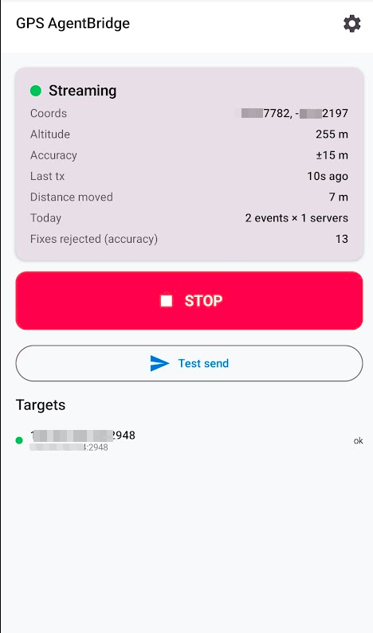

# GPS AgentBridge Android

**Distance-based GPS relay for Android — transmits NMEA 0183 via UDP to any gpsd server, only when you've moved beyond a configurable threshold.**

Turn your phone into a smart GPS sensor for any machine running `gpsd`. Originally built as a companion to the [gps-agent-bridge](https://github.com/Madvulcan/gps-agent-bridge) desktop project, GPS AgentBridge works with any setup that needs live GPS data from a phone — navigation systems, mapping tools, location logging, tracking dashboards, or anything else that speaks NMEA over UDP.

## Why this app?

Most GPS relay apps transmit at fixed intervals — every second, every 10 seconds, every minute — whether you've moved or not. That works, but it drains your phone's battery even when you're sitting at your desk for hours.

GPS AgentBridge takes a different approach: **it only transmits when something has changed.** The app polls GPS every ~30 seconds internally, but only sends data over the network when you've actually moved beyond your configured distance threshold (default 500m), or when a max-interval timer fires as a safety net (default 10 minutes). The result: drastically lower battery drain without losing the updates that matter.

## What it does

```
┌─────────────────┐     UDP NMEA     ┌─────────────────┐
│  Android Phone   │ ──────────────► │  Target Machine  │
│  GPS AgentBridge │   port 2948     │  (gpsd daemon)   │
└─────────────────┘                  └─────────────────┘
```

Your phone becomes a wireless GPS sensor. The target machine runs `gpsd`, which receives the NMEA sentences and makes the location data available to any application that needs it — mapping software, navigation tools, location logging, geocaching apps, home automation triggers, AI agents, or anything else that reads from gpsd. `gpsd` runs on Linux, macOS, and BSD, so your receiving machine isn't limited to one OS.

**Key features:**

- **Distance-based transmission** — sends only when you've moved ≥ threshold (default 500m), saving battery vs. fixed-interval polling
- **Max interval safety net** — transmits even if stationary (default 10 min), so you always get periodic updates
- **Accuracy gate** — rejects low-quality fixes before any logic runs, preventing garbage data
- **First fix always transmits** — you get data immediately after starting
- **Multi-target** — send to multiple gpsd servers simultaneously for redundancy
- **Dry-run mode** — exercise the engine without actually transmitting (for testing your setup)
- **Auto-start on boot** — optional, starts streaming automatically after reboot
- **Battery optimization onboarding** — walks you through disabling battery optimization, the #1 cause of streaming interruptions
- **Companion to [gps-agent-bridge](https://github.com/Madvulcan/gps-agent-bridge)** — works standalone with any gpsd setup, but pairs with the desktop project for location-aware agent scripts, reverse geocoding, place search, and history logging

## Screenshots



The main screen shows the current GPS status (streaming, waiting for fix, idle), live coordinates and altitude, the big START/STOP button, a test send button, and the list of configured destination servers with their send status.

## Download

Two signed release builds are available — choose based on your device:

| APK | Size | Google Play Services | Best for |
|-----|------|---------------------|----------|
| [`gps-agent-bridge-v1.3.0-standard-release.apk`](gps-agent-bridge-v1.3.0-standard-release.apk) | ~2 MB | ✅ Required | Most Android devices (better battery, sensor fusion) |
| [`gps-agent-bridge-v1.3.0-fdroid-release.apk`](gps-agent-bridge-v1.3.0-fdroid-release.apk) | ~1.5 MB | ❌ Not needed | De-Googled devices (LineageOS, GrapheneOS, F-Droid users) |

**Which one should I use?**

- **Standard** — Uses Google Play Services' FusedLocationProvider for GPS + Wi-Fi + cell + accelerometer sensor fusion. Better battery life (especially when stationary) and faster indoor GPS fixes. Choose this if your phone has Google Play Services (most phones do).
- **F-Droid** — Uses Android's raw `LocationManager` with no Google dependencies. Fully FLOSS (Free and Libre Open Source Software). Slightly higher battery drain and slower indoor fixes, but works on any Android device. This is the build that will be submitted to F-Droid.

Install via ADB:
```bash
adb install gps-agent-bridge-v1.3.0-standard-release.apk    # with Play Services (recommended)
adb install gps-agent-bridge-v1.3.0-fdroid-release.apk       # without Play Services (FLOSS)
```

Or transfer the file to your phone and install from the file manager.

> ⚠️ These are release builds signed with our release key. The F-Droid catalog version will be signed by F-Droid's own key once accepted.

## Use cases

GPS AgentBridge works with anything that can read from a `gpsd` instance. Some examples:

- **Location-aware automation** — Trigger home automation events when you arrive or leave (e.g., turn on lights when you're 500m from home)
- **Mapping and navigation** — Feed live GPS into desktop mapping applications like QGIS, GPSDrive, or Viking
- **Vehicle tracking** — Relay a phone's position to a fleet dashboard or self-hosted tracking server
- **Geocaching** — Send your real-time position to a laptop running geocaching software
- **Marine/aviation dashboards** — Use a phone as a GPS source for OpenCPN or similar navigation software
- **AI and scripting** — Pair with the [gps-agent-bridge](https://github.com/Madvulcan/gps-agent-bridge) desktop project for location-aware agent scripts, reverse geocoding, nearby place search, and location history logging
- **GPS logging** — Use `gpsd`'s logging capabilities to record your tracks on a remote machine

## Quick start

1. Make sure `gpsd` is running on your machine and listening on UDP 2948. On Debian/Ubuntu:
   ```bash
   sudo apt install gpsd gpsd-clients
   # Add UDP listener:
   echo 'DEVICES=""' | sudo tee /etc/default/gpsd
   sudo mkdir -p /etc/systemd/system/gpsd.service.d
   echo -e '[Service]\nExecStart=\nExecStart=/usr/sbin/gpsd -N -G -F /run/gpsd.sock udp://*:2948' | \
     sudo tee /etc/systemd/system/gpsd.service.d/override.conf
   sudo systemctl daemon-reload && sudo systemctl restart gpsd
   ```

2. Find your machine's IP (Tailscale works great for this — works over any network):
   ```bash
   tailscale ip -4    # Tailscale (recommended)
   hostname -I        # LAN
   ```

3. Install GPS AgentBridge on your phone and open it.
4. Walk through onboarding (location permission → battery optimization).
5. Settings → Destination servers → add `<machine-ip>:2948`.
6. Tap **START**.
7. Verify on the machine:
   ```bash
   gpspipe -w -n 10   # should show TPV with your coordinates
   ```

**Troubleshooting:**
- If the phone shows "Waiting for GPS fix" — go outside or near a window. Cold-start GPS lock takes 30-60s.
- Try **Test send** from the main screen — sends a dummy packet to verify the network path independently of GPS.
- If test send works but real streaming doesn't, check that **min accuracy** isn't set too tight for your environment (indoor GPS often has 30-100m accuracy; raise it to 200m).
- If nothing reaches the machine — check firewall rules. The machine needs UDP 2948 open from the phone's IP range.

## Build from source

### Prerequisites

- Android Studio Ladybug (2024.2) or newer
- JDK 17
- Android SDK with compileSdk 35 (Android 15), minSdk 26 (Android 8.0)
- Physical Android device running 8.0+ for testing (emulators don't have real GPS)

### First-time setup

The `gradle-wrapper.jar` is not included in the repo (binary files in git). Regenerate it:

```bash
gradle wrapper --gradle-version 8.10.2
```

Or open the project in Android Studio — it will offer to generate the wrapper on first sync.

### Build the release APK

```bash
# Standard (with Google Play Services)
./gradlew assembleStandardRelease

# F-Droid (no Google dependencies)
./gradlew assembleFdroidRelease
```

### Run unit tests

```bash
./gradlew :app:testDebugUnitTest
```

22 tests covering NMEA sentence formatting, checksum correctness, and transmission engine logic (distance/interval triggers, accuracy gate, dry-run mode, multi-target tracking).

### Install on a device

```bash
adb install app/build/outputs/apk/standard/release/app-standard-release.apk
```

## Project structure

```
app/src/
├── main/                          # Shared code (UI, NMEA, engine, service)
│   ├── kotlin/com/madvulcan/gpsagentbridge/
│   │   ├── App.kt                  — @HiltAndroidApp entry, notification channel
│   │   ├── MainActivity.kt         — single-activity host for Compose navigation
│   │   ├── data/                   — Settings, ServerTarget, DataStore-backed repo
│   │   ├── nmea/NmeaGenerator.kt   — pure Kotlin, GGA+GSA+RMC + checksum
│   │   ├── net/UdpSender.kt        — fire-and-forget UDP, multi-target parallel send
│   │   ├── location/
│   │   │   ├── LocationEngine.kt   — interface for location providers
│   │   │   ├── TransmissionEngine.kt — distance/interval logic + state machine
│   │   │   └── StreamingStateHolder.kt — process-wide bridge from service → UI
│   │   ├── service/GpsStreamingService.kt — foreground service (type: location)
│   │   ├── boot/BootReceiver.kt    — auto-start on BOOT_COMPLETED
│   │   ├── di/AppModule.kt        — Hilt singleton module
│   │   └── ui/                     — Compose screens, theme, navigation
│   └── res/                        — strings, colors, themes, launcher icon
├── standard/                       # Standard flavor (FusedLocationProvider + Play Services)
│   └── kotlin/.../location/FusedLocationEngine.kt
│   └── kotlin/.../di/LocationEngineModule.kt
└── fdroid/                         # F-Droid flavor (raw LocationManager, no Google deps)
    └── kotlin/.../location/RawLocationEngine.kt
    └── kotlin/.../di/LocationEngineModule.kt
```

## Design decisions

| Area | Choice | Why |
|---|---|---|
| UI framework | Jetpack Compose | ~40% less code than XML layouts, modern Android default |
| Location source | FusedLocationProviderClient (standard) / LocationManager (fdroid) | Standard flavor uses sensor fusion for best battery; fdroid flavor uses raw LocationManager for FLOSS compatibility |
| Persistence | Preferences DataStore | Official successor to SharedPreferences; safer concurrent-write semantics |
| NMEA sentences | GGA + GSA + RMC | Covers gpsd's needs; GSA gives DOP for free. GSV skipped — bulky and rarely changes |
| Talker ID | `GP` (GPS-only) | Maximum gpsd compatibility. `GN` also accepted but `GP` is the safer default |
| Per-transmission datagram | Single UDP packet (3 sentences joined with `\r\n`) | One packet per event — efficient and atomic |
| DI | Hilt | Standard Android DI, KSP-compiled, works with Compose ViewModels out of the box |
| Max interval default | 10 min | Sufficient for most gpsd clients while saving battery |
| State bridge | StreamingStateHolder singleton | Works because Android keeps foreground service and UI in the same process |
| Distance calculation | Pure-Kotlin haversine | No Android dependency — fully unit-testable without mocking |
| Build flavors | standard + fdroid | One flavor for users with Play Services, one for FLOSS-only devices |

## Battery expectations

| Scenario | Fixed-interval relay (60s) | This app (distance-based) |
|---|---|---|
| Stationary (desk, overnight) | ~2-5%/hour | <0.2%/hour |
| Light movement (walking) | ~2-5%/hour | ~0.5-1%/hour |
| Driving | ~2-5%/hour | ~1-2%/hour |

Based on estimates — not yet measured on real hardware. Contributions welcome.

## Settings reference

| Setting | Default | Description |
|---|---|---|
| Distance threshold | 500 m | How far you must move before a transmission fires |
| Max interval | 10 min | Transmit even if you haven't moved (safety net) |
| Min accuracy | 20 m | Reject fixes with worse accuracy (prevents garbage data) |
| Dry run | Off | Run the engine without actually sending UDP packets |
| Detailed notification | Off | Show coordinates in the persistent notification |
| Auto-start on boot | Off | Start streaming automatically when the phone reboots |
| Destination servers | (none) | One or more `host:port` pairs for UDP NMEA transmission |

## Known limitations

- **F-Droid flavor has slightly reduced accuracy indoors** — Uses raw LocationManager without Wi-Fi/cell positioning fallback (standard flavor has this via Play Services). Both flavors perform similarly outdoors.
- **No location history on the phone** — The phone is a GPS sensor; logging happens on the receiving end.
- **StreamingStateHolder is a singleton** — Works because Android keeps foreground service and UI in the same process. If the service were ever moved to a separate process (unlikely), this would need to become a proper service binder.

## Changelog

See [CHANGELOG.md](CHANGELOG.md) for release history.

## License

MIT — see [LICENSE](LICENSE).
